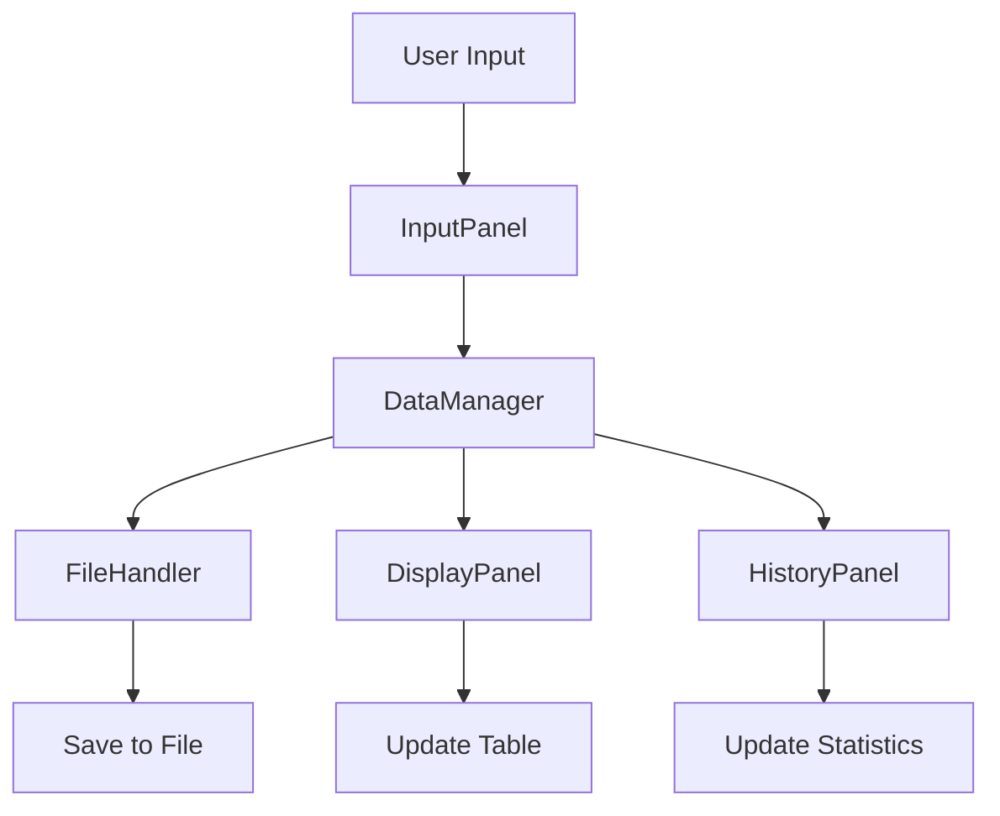

# 🎓 Sistem Manajemen Data Mahasiswa

<div align="center">


**Sistem manajemen data mahasiswa canggih dengan GUI modern yang dibangun menggunakan Java Swing**

[Fitur](#-fitur) • [Instalasi](#-instalasi) • [Penggunaan](#-penggunaan) • [Dokumentasi](#-dokumentasi)

</div>

## 📋 Daftar Isi

- [Gambaran Umum](#-gambaran-umum)
- [Fitur](#-fitur)
- [Instalasi](#-instalasi)
- [Penggunaan](#-penggunaan)
- [Dokumentasi](#-dokumentasi)
- [Contoh Penggunaan](#-contoh-penggunaan)
- [FAQ](#-faq)

## 🚀 Gambaran Umum

**Sistem Manajemen Data Mahasiswa** adalah aplikasi desktop canggih untuk mengelola data mahasiswa secara komprehensif. Dibangun dengan Java Swing, sistem ini menawarkan antarmuka grafis modern dengan berbagai fitur manajemen data yang powerful.

### ✨ Highlights

- 🎨 **GUI Modern** dengan tabbed interface yang intuitif
- 💾 **Penyimpanan Otomatis** data ke file binary
- 📊 **Statistik Real-time** performa akademik
- 🔍 **Pencarian & Filter** data yang powerful
- 📁 **Export Data** ke format CSV
- 🏆 **Sistem Status Otomatis** (Cum Laude, Sangat Memuaskan, dll)
- 🚀 **Multi-layer Architecture** yang terstruktur

## 🌟 Fitur

### 👥 Core Features
- **Manajemen Data Lengkap** - Nama, NIM, jurusan, fakultas, dll
- **Data Akademik** - IP Semester, IP Kumulatif, semester
- **Informasi Kontak** - Email, telepon, alamat
- **Riwayat Beasiswa** - Tracking prestasi mahasiswa

### 📈 Academic Features
- **Status Otomatis** - Penentuan status berdasarkan IPK
- **Statistik Kelas** - Rata-rata IPK, distribusi nilai
- **Filter Berdasarkan Status** - Cum Laude, Sangat Memuaskan, dll
- **Tracking Semester** - Monitoring perkembangan akademik

### 💾 Data Management
- **Auto-save** - Penyimpanan otomatis ke file binary
- **Backup System** - Backup data dengan timestamp
- **Export CSV** - Ekspor data untuk analisis eksternal
- **Import Data** - Load data dari file existing
- **Data Validation** - Validasi input untuk integritas data

### 🎨 GUI Features
- **Tabbed Interface** - Navigasi yang terorganisir
- **Real-time Search** - Pencarian instan
- **Sorting Table** - Pengurutan data di tabel
- **Responsive Design** - Adaptif berbagai resolusi
- **Professional Styling** - Warna dan layout yang modern

### 🔧 Advanced Features
- **Singleton Pattern** - Manajemen data yang efisien
- **Serialization** - Penyimpanan objek Java
- **Exception Handling** - Error handling yang robust
- **Data Persistence** - Data tetap aman setelah restart


## 📥 Instalasi

### Prerequisites

- Java JDK 8 atau lebih tinggi
- Sistem operasi: Windows, macOS, atau Linux

### Step-by-Step Installation

1. **Download Project**
   ```bash
   git clone https://github.com/username/sistem-mahasiswa-super.git
   cd sistem-mahasiswa-super
   ```

2. **Verifikasi Java Installation**
   ```bash
   java -version
   javac -version
   ```

3. **Compile Project**
   ```bash
   # Compile semua file Java
   javac -d . src/model/*.java src/utils/*.java src/gui/*.java src/Main.java
   ```

4. **Jalankan Aplikasi**
   ```bash
   java Main
   ```

### Quick Install (Windows)
```bash
# Download project dan double-click run.bat
./run.bat
```

### Build dengan IDE (Recommended)

1. **Buka di IntelliJ IDEA atau Eclipse**
2. **Import sebagai Java Project**
3. **Set JDK ke version 8+**
4. **Run Main.java**

## 🎮 Penggunaan

### Menjalankan Aplikasi

```bash
java Main
```

### Basic Usage

1. **Input Data Mahasiswa**
   - Buka tab "Input Data"
   - Isi semua field yang diperlukan
   - Klik "Simpan Data"

2. **Lihat & Kelola Data**
   - Buka tab "Lihat Data"
   - Gunakan search box untuk pencarian
   - Filter berdasarkan status akademik
   - Hapus data dengan tombol "Hapus Data Terpilih"

3. **Statistik & Riwayat**
   - Buka tab "Riwayat & Statistik"
   - Lihat statistik lengkap
   - Ekspor data ke CSV

### Keyboard Shortcuts

| Shortcut | Action |
|----------|--------|
| `Ctrl + S` | Simpan data (di input form) |
| `Enter` | Submit form |
| `Ctrl + F` | Focus ke search box |
| `Ctrl + E` | Ekspor data |

### Status Akademik Otomatis

Sistem secara otomatis menentukan status mahasiswa berdasarkan IPK:

| IPK | Status |
|-----|--------|
| ≥ 3.5 | 🏆 Cum Laude |
| 3.0 - 3.49 | ⭐ Sangat Memuaskan |
| 2.5 - 2.99 | ✅ Memuaskan |
| < 2.5 | 📚 Cukup |

## 📚 Dokumentasi

### Architecture Overview

```
Sistem Manajemen Data Mahasiswa
├── Presentation Layer (GUI)
│   ├── MainFrame - Window utama
│   ├── InputPanel - Form input data
│   ├── DisplayPanel - Tampilan tabel data
│   └── HistoryPanel - Statistik & riwayat
├── Business Logic Layer
│   ├── DataManager - Manajemen data (Singleton)
│   └── Mahasiswa - Model data
├── Data Access Layer
│   └── FileHandler - File I/O operations
└── Utilities Layer
    └── Constants - Konfigurasi aplikasi
```

### Design Patterns Used

- **Singleton Pattern** - DataManager
- **MVC Pattern** - Separation of concerns
- **Observer Pattern** - Data updates
- **Factory Pattern** - Object creation

### Data Flow



## 🗂️ Struktur Project

```
sistem-manajemen-data-mahasiswa/
│
├── 📁 src/
│   ├── 📁 model/
│   │   ├── Mahasiswa.java          # Model data mahasiswa
│   │   └── DataManager.java        # Singleton data manager
│   │
│   ├── 📁 gui/
│   │   ├── MainFrame.java          # Main application window
│   │   ├── InputPanel.java         # Input form panel
│   │   ├── DisplayPanel.java       # Data display panel
│   │   └── HistoryPanel.java       # Statistics panel
│   │
│   ├── 📁 utils/
│   │   └── FileHandler.java        # File I/O operations
│   │
│   └── Main.java                   # Application entry point
│
├── 💾 data_mahasiswa.dat          # Auto-generated data file
├── 📄 README.md                   # Dokumentasi ini
└── 📄 LICENSE.md                  # MIT License file
```

### File Descriptions

| File | Description |
|------|-------------|
| `Main.java` | Entry point aplikasi |
| `Mahasiswa.java` | Model data dengan semua atribut mahasiswa |
| `DataManager.java` | Singleton class untuk manajemen data |
| `MainFrame.java` | Main window dengan tabbed interface |
| `InputPanel.java` | Form input data mahasiswa |
| `DisplayPanel.java` | Tabel data dengan fitur search & filter |
| `HistoryPanel.java` | Statistik dan export functionality |
| `FileHandler.java` | Handling serialization dan file operations |


## 💡 Contoh Penggunaan

### Input Data Baru

1. **Buka tab "Input Data"**
2. **Isi form:**
   ```
   Nama: Christina Angelina
   NIM: 11211095
   Jurusan: Teknik, Informatika dan Bisnis
   Fakultas: FISTII
   IP Semester: 3.98
   IP Kumulatif: 3.99
   Riwayat Beasiswa: Beasiswa Unggulan 2099
   Email: angel@university.edu
   Telepon: 08123456789
   Alamat: Jl. Pendidikan No. 123
   Semester: 7
   ```

3. **Klik "Simpan Data"** - Data otomatis tersimpan dan status "Cum Laude" akan diberikan

### Pencarian Data

1. **Buka tab "Lihat Data"**
2. **Ketik di search box:**
   ```
   "Christina"
   ```
3. **Atau filter berdasarkan status:**
   ```
   Pilih "Cum Laude" dari dropdown filter
   ```

### Ekspor Data

1. **Buka tab "Riwayat & Statistik"**
2. **Klik "Ekspor ke CSV"**
3. **Pilih lokasi penyimpanan**
4. **Data akan diekspor dengan format CSV lengkap**


## ❓ FAQ

### Q: Apakah data tersimpan otomatis?
**A:** Ya! Semua data secara otomatis tersimpan ke file `data_mahasiswa.dat` setiap kali ada perubahan.

### Q: Bagaimana cara backup data?
**A:** Gunakan menu File → Backup Data, atau copy file `data_mahasiswa.dat` secara manual.

### Q: Format apa yang didukung untuk ekspor?
**A:** Saat ini mendukung ekspor ke format CSV yang kompatibel dengan Excel dan aplikasi spreadsheet lainnya.

### Q: Bisakah diintegrasikan dengan database?
**A:** Ya! Architecture sudah modular, bisa dengan mudah diintegrasikan dengan MySQL, PostgreSQL, dll.

### Q: Apa requirement sistem minimum?
**A:** Java JDK 8+, RAM 2GB, Storage 100MB. Compatible dengan Windows, macOS, dan Linux.

### Q: Bagaimana cara reset semua data?
**A:** Hapus file `data_mahasiswa.dat` dan restart aplikasi.

## 🐛 Troubleshooting

### Common Issues

1. **Error: "Unresolved compilation problem"**
   - Pastikan semua file sudah ter-compile dengan benar
   - Gunakan `javac -d . src/**/*.java` untuk compile semua file

2. **GUI tidak muncul**
   - Pastikan Java version 8+
   - Coba run dengan `java -Djava.awt.headless=false Main`

3. **Data tidak tersimpan**
   - Check permission folder
   - Pastikan tidak ada aplikasi lain yang membuka file data

### Performance Tips

- Tutup aplikasi lain yang berat saat menggunakan sistem
- Untuk data > 10,000 records, consider implement virtual scrolling
- Regular backup data penting

---

<div align="center">

## 📊 Sample Data Stats


**⭐ Jangan lupa beri bintang jika project ini membantu! ⭐**

[Kembali ke Atas](#-sistem-manajemen-data-mahasiswa)

</div>